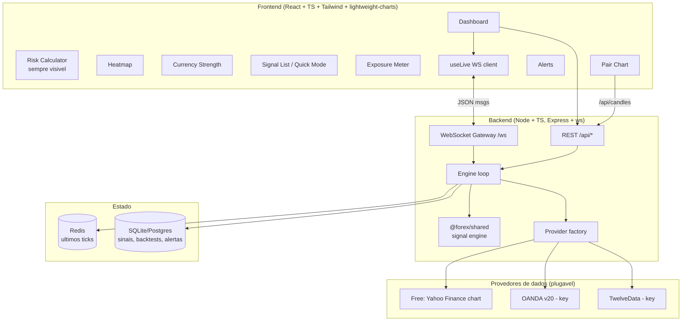

# Arquitetura — Forex Cockpit

## 1. Diagrama de componentes



## 2. Fluxo de dados (ciclo do motor)

```mermaid
sequenceDiagram
  participant Loop as Engine.runOnce (a cada POLL_INTERVAL_MS)
  participant Prov as DataProvider
  participant Shared as signal engine
  participant Store as DB
  participant Cache as Redis
  participant GW as WS Gateway
  participant UI as Browser

  loop cada par
    Loop->>Prov: getCandles(par, [M5,M15,H1,H4,D1], 200)
    Prov-->>Loop: candles por timeframe
    Loop->>Shared: trendOf(tf) -> tendencia MTF
    Loop->>Prov: getQuote(par)
    Prov-->>Loop: preco + ts
    Loop->>Cache: setTick(par, preco, ts)
    Loop->>Shared: backtest(par, TF_principal) [cache 30min]
    Loop->>Shared: buildSignal(par, candles, risco, {threshold, mtf, validation})
    Shared-->>Loop: Signal {entry, SL(ATR), TPs(R:R>=1.5), size, score, validacao} ou null
    Loop->>Store: saveSignal + saveBacktest
  end
  Loop->>Shared: currencyStrength(variacoes)
  Loop->>GW: broadcast(snapshot + signals)
  GW->>UI: mensagens WS
  UI->>UI: recalcula position size ao vivo com o risco do usuario
```

## 3. Decisoes-chave

- **Motor em pacote compartilhado (`@forex/shared`)** — os mesmos indicadores,
  regras de confluencia e calculo de risco rodam no backend (emissao) e no
  frontend (recalculo de size ao vivo). Garante consistencia e testabilidade.
- **Camada de dados plugavel** — interface `DataProvider` com 3 implementacoes.
  Sem key, o `free` (Yahoo) cobre todos os pares/TFs via fetch server-side
  (sem CORS). Com key, troca-se `DATA_PROVIDER` para `oanda`/`twelvedata`.
- **Degradacao graciosa** — sem Redis cai para cache em memoria; sem
  better-sqlite3 cai para store em memoria. A app sobe em qualquer ambiente.
- **Risco nao removivel** — `buildSignal` so retorna um sinal com `stopLoss`
  (ATR) e `sizing` preenchidos. A UI nunca renderiza sinal sem ambos.
- **Validacao antes da confianca** — cada padrao roda em `backtest()`; abaixo de
  `BACKTEST_MIN_SAMPLE` o sinal e marcado "nao validado".

## 4. Mapa de timeframes (provider free / Yahoo)

| TF  | Yahoo interval | range | observacao            |
|-----|----------------|-------|-----------------------|
| M1  | 1m             | 5d    |                       |
| M5  | 5m             | 1mo   |                       |
| M15 | 15m            | 1mo   |                       |
| H1  | 60m            | 3mo   |                       |
| H4  | 60m            | 6mo   | agregado 60m x4       |
| D1  | 1d             | 2y    |                       |
| W1  | 1wk            | 5y    |                       |
