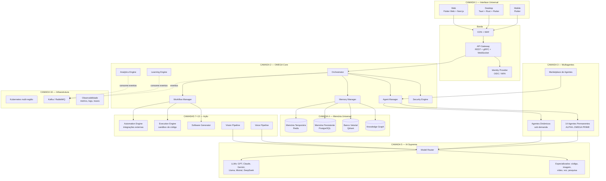
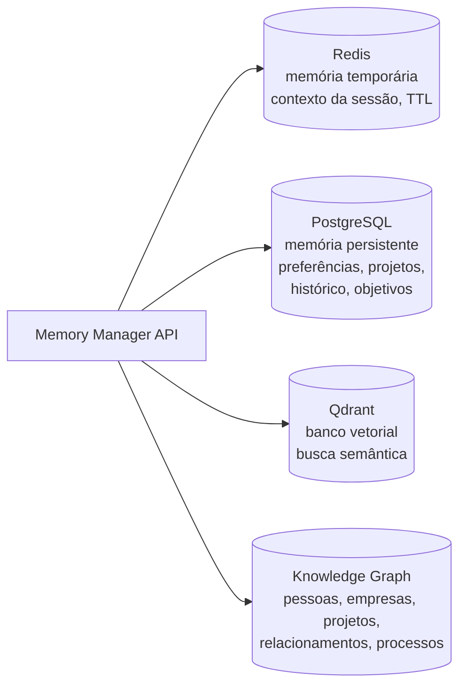

# OMEGA JARVIS X INFINITY ASCENSION

## Arquitetura Empresarial Completa de Engenharia

> **Status:** Documento de arquitetura — versão 1.0
> **Escopo:** Plataforma Operacional de Inteligência Artificial (AI Operating System) — cérebro digital, sistema operacional cognitivo, central de automação e coordenador de milhares de agentes inteligentes, projetada para milhões de usuários simultâneos.

---

## Índice

1. [Visão geral e princípios](#1-visão-geral-e-princípios)
2. [Diagrama macro do sistema](#2-diagrama-macro-do-sistema)
3. [Camada 1 — Interface Universal](#3-camada-1--interface-universal)
4. [Camada 2 — OMEGA Core](#4-camada-2--omega-core)
5. [Camada 3 — Sistema Multiagentes](#5-camada-3--sistema-multiagentes)
6. [Camada 4 — Memória Universal](#6-camada-4--memória-universal)
7. [Camada 5 — IA Suprema (Model Router)](#7-camada-5--ia-suprema-model-router)
8. [Camada 6 — Aprendizado Contínuo](#8-camada-6--aprendizado-contínuo)
9. [Camada 7 — Motor de Automação](#9-camada-7--motor-de-automação)
10. [Camada 8 — Motor de Execução](#10-camada-8--motor-de-execução)
11. [Camadas 9–14 — Domínios de aplicação](#11-camadas-914--domínios-de-aplicação)
12. [Camada 15 — Segurança](#12-camada-15--segurança)
13. [Camada 16 — Infraestrutura Global](#13-camada-16--infraestrutura-global)
14. [Camadas 17–19 — Observabilidade, previsão e autootimização](#14-camadas-1719--observabilidade-previsão-e-autootimização)
15. [Modelo de dados de referência](#15-modelo-de-dados-de-referência)
16. [Contratos de API](#16-contratos-de-api)
17. [Escalabilidade para milhões de usuários](#17-escalabilidade-para-milhões-de-usuários)
18. [Roadmap de implementação por fases](#18-roadmap-de-implementação-por-fases)
19. [Riscos e mitigação](#19-riscos-e-mitigação)
20. [Camada 20 — Objetivo final e governança](#20-camada-20--objetivo-final-e-governança)

---

## 1. Visão geral e princípios

O OMEGA JARVIS X INFINITY ASCENSION é organizado em **20 camadas** agrupadas em 5 planos de engenharia:

| Plano | Camadas | Função |
|-------|---------|--------|
| **Experiência** | 1, 17 | Interfaces (mobile, desktop, web) e dashboards |
| **Cognição** | 2, 3, 5, 6 | Orquestração, agentes, roteamento de modelos, aprendizado |
| **Conhecimento** | 4, 10, 18 | Memória, banco vetorial, knowledge graph, previsão |
| **Ação** | 7, 8, 9, 11, 12, 13, 14 | Automação, execução, geração de software, marketplace |
| **Fundação** | 15, 16, 19 | Segurança, infraestrutura, autootimização |

### Princípios arquiteturais

1. **API-first** — toda capacidade é exposta como API versionada; as interfaces são apenas clientes.
2. **Event-driven** — comunicação assíncrona entre serviços via Kafka; nenhum serviço bloqueia esperando outro.
3. **Multi-tenant desde o dia 1** — isolamento por organização (tenant) em dados, memória, agentes e billing.
4. **Model-agnostic** — nenhum serviço conhece um provedor de LLM diretamente; tudo passa pelo Model Router (Camada 5).
5. **Zero Trust** — nenhum componente confia em outro sem autenticação mútua (mTLS + OIDC service-to-service).
6. **Human-in-the-loop** — toda ação de escrita no mundo externo (enviar e-mail, executar automação, publicar código) passa por política de aprovação configurável pelo usuário.
7. **Degradação graciosa** — se um provedor de modelo ou integração cai, o sistema roteia para alternativa ou enfileira, nunca perde a requisição.

---

## 2. Diagrama macro do sistema



---

## 3. Camada 1 — Interface Universal

### 3.1 Estratégia de código compartilhado

Um único core Dart/Flutter (`omega_ui_core`) compartilhado entre mobile, desktop e web, com camadas nativas específicas:

```
apps/
  mobile/          Flutter (Android, iOS, tablets)
  desktop/         Tauri (Rust) hospedando Flutter Desktop
  web/             Flutter Web (app) + Next.js/TypeScript (portal, SEO, marketing)
packages/
  omega_ui_core/   Design system, estado, widgets
  omega_client/    SDK cliente (REST/gRPC/WS), gerado do OpenAPI
  omega_offline/   Cache local, sync, fila offline-first
```

### 3.2 Módulos funcionais (todas as plataformas)

| Módulo | Descrição | Transporte |
|--------|-----------|------------|
| Chat multimodal | Texto, imagem, arquivo, áudio | WebSocket (streaming de tokens) |
| Voz em tempo real | Conversa contínua full-duplex | WebRTC + WebSocket |
| Controle de agentes | Criar, pausar, configurar, monitorar agentes | REST + WS (status live) |
| Dashboard executivo | KPIs, custos, uso | REST (agregados) |
| Centro financeiro | Contas, orçamentos, projeções | REST |
| Centro de produtividade | Tarefas, calendário, notas | REST + sync offline |
| Central de automações | Fluxos, gatilhos, histórico de execução | REST + WS |
| Gestão de projetos | Kanban, milestones, alocação | REST |
| Monitoramento em tempo real | Execuções, alertas, saúde do sistema | WS / SSE |

### 3.3 Desktop (Tauri + Rust)

* **Múltiplas janelas** — janela principal + janelas destacáveis por módulo.
* **Execução local de IA** — runtime de inferência local (llama.cpp / ONNX Runtime via Rust) para modo offline e dados sensíveis; o Model Router decide local × nuvem.
* **Automações de SO** — acesso a arquivos, atalhos globais, tray, com permissões granulares assinadas.

---

## 4. Camada 2 — OMEGA Core

O OMEGA Core **não é um monólito**: é um conjunto de serviços com um Orchestrator central stateless (escala horizontal) e estado externalizado.

### 4.1 Módulos

| Módulo | Responsabilidade | Estado |
|--------|------------------|--------|
| **Orchestrator** | Recebe intenções, planeja (task graph), delega, agrega respostas | Stateless (estado em Redis/PG) |
| **Agent Manager** | Ciclo de vida de agentes: registro, spawn, health, quotas | PostgreSQL |
| **Memory Manager** | API única de leitura/escrita de memória (roteia para STM/LTM/vetorial/grafo) | — |
| **Workflow Manager** | Definição e execução de fluxos (DAGs), retries, compensação | Temporal.io (ou equivalente) |
| **Learning Engine** | Feedback, fine-tuning de políticas de roteamento, detecção de padrões | Data lake |
| **Security Engine** | AuthZ (políticas), auditoria, classificação de risco de ações | PostgreSQL + logs imutáveis |
| **Analytics Engine** | Métricas de uso, custo por tenant/agente/modelo | ClickHouse |

### 4.2 Ciclo de decisão do Orchestrator

```
Intenção do usuário
  → Classificação (intenção, domínio, risco)
  → Recuperação de contexto (Memory Manager)
  → Planejamento (task graph: quais agentes, em que ordem, paralelo ou serial)
  → Verificação de política (Security Engine: essa ação exige aprovação humana?)
  → Execução (Agent Manager / Workflow Manager)
  → Validação final (OMEGA PRIME)
  → Resposta + persistência de memória + eventos para Learning/Analytics
```

---

## 5. Camada 3 — Sistema Multiagentes

### 5.1 Agentes permanentes

| Agente | Domínio | Exemplos de responsabilidade |
|--------|---------|------------------------------|
| ALPHA | Lógica | Raciocínio formal, decomposição de problemas, verificação de consistência |
| BETA | Criatividade | Brainstorm, redação criativa, design de conceitos |
| GAMMA | Dados | Análise, SQL, estatística, visualização |
| DELTA | Programação | Código, revisão, debugging, arquitetura de software |
| EPSILON | Negócios | Estratégia, modelos de negócio, operações |
| ZETA | Marketing | Campanhas, copy, SEO, análise de audiência |
| ETA | Pesquisa | Busca, síntese de fontes, revisão de literatura |
| THETA | Segurança | Análise de risco, revisão de permissões, threat modeling |
| IOTA | Finanças | Orçamento, projeção, análise de investimento (informativo) |
| KAPPA | Automação | Desenho e manutenção de fluxos da Camada 7 |
| LAMBDA | Educação | Trilhas de aprendizado, tutoria, avaliação |
| SIGMA | Psicologia | Comunicação, dinâmica de equipes (informativo) |
| PHI | Saúde | Informação de saúde geral (informativo, nunca diagnóstico) |
| **OMEGA PRIME** | Validação final | Revisa saídas críticas antes da entrega: fatualidade, política, segurança |

### 5.2 Especificação de agente (Agent Spec)

Todo agente — permanente, dinâmico ou de marketplace — é descrito por um manifesto declarativo:

```yaml
apiVersion: omega/v1
kind: Agent
metadata:
  name: delta
  tier: permanent          # permanent | dynamic | marketplace
spec:
  role: "Especialista em programação e engenharia de software"
  model_policy:
    preferred: [claude, gpt]
    capabilities: [code, long-context]
  tools:
    - code_executor        # Camada 8
    - repo_access
    - web_search
  memory:
    scopes: [session, project]
  limits:
    max_tokens_per_task: 200000
    max_cost_per_task_usd: 2.00
    timeout_s: 600
  guardrails:
    requires_omega_prime_review: true   # para ações de escrita
    forbidden_actions: [payments, credential_access]
```

### 5.3 Agentes dinâmicos

O Agent Manager cria especialistas sob demanda (SAP, AWS, Medicina, Mercado Financeiro, Engenharia…):

1. Orchestrator detecta lacuna de competência no task graph.
2. Agent Manager gera um Agent Spec a partir de um template + prompt de especialização + fontes da Camada 4 (RAG do domínio).
3. O agente roda em sandbox com quota reduzida; se reutilizado com bom feedback (Learning Engine), é promovido a agente "estável" do tenant.
4. TTL: agentes dinâmicos sem uso por N dias são arquivados (spec preservado, runtime liberado).

### 5.4 Comunicação entre agentes

* **Protocolo:** mensagens estruturadas (JSON) em tópicos Kafka `agent.<tenant>.<task_id>`, com contrato `AgentMessage {task_id, from, to, type: request|result|critique|escalation, payload, cost, trace_id}`.
* **Padrões suportados:** pipeline (serial), fan-out/fan-in (paralelo com agregação), debate (dois agentes + OMEGA PRIME como juiz), crítica cruzada (THETA revisa segurança de qualquer saída).

---

## 6. Camada 4 — Memória Universal

### 6.1 Quatro armazenamentos, uma API



| Camada | Tecnologia | Conteúdo | Retenção |
|--------|-----------|----------|----------|
| Temporária | Redis Cluster | Contexto da conversa/tarefa atual | TTL horas |
| Persistente | PostgreSQL (particionado por tenant) | Preferências, projetos, histórico, objetivos | Política do usuário |
| Vetorial | Qdrant (primário; Weaviate/Pinecone como alternativas plugáveis) | Embeddings de documentos, conversas, conhecimento pessoal | Política do usuário |
| Grafo | Neo4j / Apache AGE | Entidades e relações: pessoas, empresas, projetos, processos | Política do usuário |

### 6.2 Pipeline de escrita de memória

Toda interação relevante passa por um pipeline assíncrono (consumidor Kafka):

```
Evento de conversa/tarefa
  → Extração (entidades, fatos, preferências)  [modelo pequeno/barato]
  → Classificação (efêmero | persistente | grafo)
  → Deduplicação e conflito (fato novo contradiz antigo? versiona)
  → Escrita (LTM + embedding no vetorial + upsert de nós/arestas no grafo)
```

### 6.3 Recuperação (contexto para agentes)

`MemoryManager.retrieve(query, scopes, budget_tokens)` combina: busca semântica (vetorial) + fatos estruturados (LTM) + vizinhança no grafo, com re-ranking e corte pelo orçamento de tokens da tarefa.

**Isolamento:** namespace por tenant em todos os stores; chaves de criptografia por tenant (envelope encryption).

---

## 7. Camada 5 — IA Suprema (Model Router)

### 7.1 Roteamento automático

O Model Router é o único componente que fala com provedores de modelos. Decide por tarefa:

```
score(modelo) = w1·capacidade(tarefa) + w2·custo + w3·latência + w4·disponibilidade + w5·política_do_tenant
```

* **Registro de modelos** — catálogo com capacidades (código, visão, contexto longo, raciocínio), preço por token, limites e regiões: GPT, Claude, Gemini, Llama, Mistral, DeepSeek + modelos especializados (código, imagem, vídeo, voz, pesquisa) + modelos locais (desktop/edge).
* **Fallback em cascata** — provedor caiu ou rate-limited → próximo da lista de compatibilidade, com tradução automática do formato de prompt/ferramentas.
* **Normalização** — API interna única (estilo OpenAI-compatible + extensões) para todos os provedores; adapters por provedor.
* **Cache** — cache semântico de respostas para consultas repetidas (economia de custo), respeitando isolamento por tenant.
* **Aprendizado** — o Learning Engine (Camada 6) ajusta os pesos `w1..w5` com base em feedback e resultado real.

---

## 8. Camada 6 — Aprendizado Contínuo

O Learning Engine **não treina modelos de fundação**; ele otimiza o sistema em torno deles:

| Fonte | O que aprende | Mecanismo |
|-------|---------------|-----------|
| Feedback explícito (👍/👎, edições) | Qualidade por agente/modelo/tipo de tarefa | Ajuste dos pesos do Model Router; ajuste de prompts de sistema |
| Uso (telemetria) | Padrões de fluxo, automações candidatas ("você faz isso toda segunda") | Mineração de sequências em ClickHouse → sugestões de automação |
| Documentos do tenant | Conhecimento de domínio | Ingestão contínua → Camada 4 (RAG), nunca treino global |
| Erros de execução | Prompts/planos que falham | Banco de casos; few-shot correção no planejamento |

**Governança:** todo aprendizado é por tenant (nenhum dado cruza tenants), auditável e reversível; melhorias automáticas entram como propostas supervisionadas (Camada 19).

---

## 9. Camada 7 — Motor de Automação

### 9.1 Arquitetura de integrações

```
Automation Engine
  ├── Trigger Service     (webhooks, agendamento cron, eventos internos)
  ├── Flow Runtime        (execução de DAGs via Workflow Manager/Temporal)
  ├── Connector Framework (SDK de conectores, isolados em containers)
  └── Credential Vault    (OAuth tokens, API keys — HashiCorp Vault)
```

**Conectores de primeira classe:** WhatsApp, Telegram, Discord, Slack, Gmail, Outlook, Google Drive, OneDrive, GitHub, Notion, Trello, Jira, CRMs, ERPs. Cada conector é um container isolado com contrato padrão (`actions[]`, `triggers[]`, `auth`), permitindo marketplace de conectores da comunidade.

### 9.2 Criação de fluxos

* **Por linguagem natural:** "toda vez que chegar e-mail do cliente X, resuma e mande no Slack" → agente KAPPA gera o DAG, usuário revisa e ativa.
* **Editor visual** na Camada 1 (nós = triggers/ações/condições/agentes).
* **Execução:** cada passo é uma activity Temporal com retry/compensação; ações externas de escrita respeitam a política de aprovação do tenant.

---

## 10. Camada 8 — Motor de Execução

Executa código e cria artefatos de forma segura:

* **Sandbox:** microVMs (Firecracker) ou gVisor, sem rede por padrão, rede permitida por allowlist; limites de CPU/RAM/tempo por tarefa.
* **Capacidades:** criar sistemas, aplicativos, APIs, bancos de dados, dashboards e automações — via templates + geração por DELTA + validação por testes.
* **Pipeline:** gerar → executar testes no sandbox → lint/scan de segurança (THETA) → entregar artefato (repo Git, container, deploy opcional).
* **Provisionamento:** infraestrutura gerada como IaC (Terraform/Pulumi) revisável, nunca aplicada sem aprovação.

---

## 11. Camadas 9–14 — Domínios de aplicação

Todos os domínios são **aplicações compostas** sobre as camadas 2–8 (não têm lógica de IA própria):

| Camada | Domínio | Composição |
|--------|---------|-----------|
| 9 | **Central Empresarial** — ERP, CRM, BI inteligentes, planejamento estratégico, financeiro, comercial, pessoas | GAMMA + EPSILON + IOTA + conectores ERP/CRM (C7) + dashboards (C17) |
| 10 | **Central Científica** — pesquisa automatizada, leitura e comparação de artigos, relatórios, monitoramento tecnológico | ETA + ingestão de PDFs (C12) + RAG (C4) + relatórios (C8) |
| 11 | **Sistema de Voz** — conversação natural, reconhecimento emocional, tradução simultânea, assistente contínuo | Pipeline: VAD → STT (Whisper/local) → Orchestrator → TTS (ElevenLabs/local), WebRTC, latência-alvo < 800 ms fala-a-fala |
| 12 | **Visão Computacional** — objetos, documentos (OCR), imagens, padrões, vídeos | Modelos de visão via Model Router + pipeline de ingestão de mídia (fila + workers GPU) |
| 13 | **Gerador de Software** — SaaS, apps, landing pages, APIs, painéis, com testes automáticos | Templates + DELTA + Motor de Execução (C8) + CI gerado |
| 14 | **Mercado de Agentes** — loja de agentes financeiros, jurídicos, médicos informativos, empresariais, educacionais | Registry de Agent Specs assinados + revisão de segurança (THETA + humana) + billing por uso |

**Marketplace — controles obrigatórios:** assinatura criptográfica dos manifests, permissões declaradas (estilo lojas de apps), sandbox de execução, revisão para categorias sensíveis (saúde/jurídico sempre com disclaimers e modo informativo).

---

## 12. Camada 15 — Segurança

| Controle | Implementação |
|----------|---------------|
| Zero Trust | mTLS entre todos os serviços (service mesh — Istio/Linkerd); SPIFFE/SPIRE para identidade de workload |
| Autenticação | OIDC (Keycloak/Auth0), MFA obrigatório configurável, passkeys/WebAuthn |
| Autorização | RBAC + ABAC por tenant, políticas como código (OPA/Cedar); permissões granulares por agente, conector e ação |
| Criptografia | AES-256-GCM em repouso (envelope encryption, chaves por tenant em KMS/HSM), TLS 1.3 em trânsito |
| Auditoria | Log imutável (append-only, hash-chained) de toda ação de agente, acesso a memória e execução de automação; exportável para SIEM |
| Ameaças | Detecção de anomalia de uso, rate limiting, proteção a prompt injection (isolamento de conteúdo externo, política de ferramentas por origem do texto), WAF |
| Dados | Classificação automática (PII, financeiro, saúde), mascaramento em logs, direito ao esquecimento (purge por tenant/usuário em todos os stores) |
| Supervisão humana | Matriz de risco de ações: leitura = livre; escrita externa = política do tenant; irreversível/financeiro = aprovação humana explícita sempre |

---

## 13. Camada 16 — Infraestrutura Global

### 13.1 Topologia

* **Multi-cloud:** AWS (primária), Google Cloud e Azure (regiões complementares/DR). Abstração via Kubernetes + Terraform para evitar lock-in nas cargas principais.
* **Multi-região ativa-ativa:** Américas, Europa, Ásia; roteamento por latência + residência de dados (tenant escolhe região dos seus dados — GDPR/LGPD).
* **Células (cell-based architecture):** cada célula atende N tenants com stack completa (K8s + PG + Redis + Qdrant); blast radius limitado, escala por adição de células.

### 13.2 Stack

| Função | Tecnologia |
|--------|-----------|
| Containers/orquestração | Docker + Kubernetes (EKS/GKE/AKS), KEDA para autoscaling por fila |
| Mensageria | Kafka (event backbone, eventos de domínio) + RabbitMQ (RPC assíncrono/tarefas curtas) |
| Dados transacionais | PostgreSQL (Aurora/Cloud SQL), particionado por tenant |
| Cache/estado quente | Redis Cluster |
| Documentos | MongoDB (conteúdo flexível: fluxos, manifests, artefatos) |
| Vetorial | Qdrant (auto-hospedado) |
| Analítico | ClickHouse (telemetria, custos, analytics) |
| Workflows | Temporal |
| Segredos | Vault + KMS |
| GPU | Node pools dedicados (inferência local de STT/visão/modelos abertos), com fila própria |

---

## 14. Camadas 17–19 — Observabilidade, previsão e autootimização

### Camada 17 — Dashboard Supremo

Frontend (C1) sobre o Analytics Engine: Assistente Principal, Controle Financeiro, Gestão de Projetos, Gestão de Equipes, Centro de Pesquisa, Centro de IA (uso/custo por modelo e agente), Centro de Automação (execuções, falhas), Centro de Negócios, Centro de Saúde (informativo), Centro de Conhecimento (memória navegável — o usuário vê e edita o que o sistema sabe sobre ele).

### Camada 18 — Previsão Estratégica

Serviço que combina ETA (pesquisa) + GAMMA (dados) + séries temporais: análise de tendências, mercados, negócios, tecnologias e oportunidades, gerando **cenários probabilísticos** (melhor/base/pior caso com premissas explícitas e fontes citadas — nunca previsão sem rastreabilidade).

### Camada 19 — Autootimização

Loop de melhoria contínua **supervisionado**:

```
Monitorar (latência, custo, eficiência, precisão, satisfação — SLOs por serviço)
  → Detectar regressão/oportunidade (Analytics + Learning Engine)
  → Propor mudança (ajuste de roteamento, prompt, escala, cache)
  → Aprovar (automático apenas para mudanças de baixo risco pré-classificadas;
             humano para o restante)
  → Aplicar com canário + rollback automático
```

---

## 15. Modelo de dados de referência

Entidades principais (PostgreSQL, simplificado):

```
tenants(id, name, region, plan, data_policy)
users(id, tenant_id, email, auth_provider, mfa_enabled, roles[])
agents(id, tenant_id NULL para globais, spec_jsonb, tier, status, version)
sessions(id, user_id, channel, started_at)
tasks(id, tenant_id, session_id, intent, plan_jsonb, status, cost_usd, trace_id)
task_steps(id, task_id, agent_id, model_used, tokens_in, tokens_out, latency_ms, result_ref)
memories(id, tenant_id, user_id, kind, content_jsonb, embedding_ref, source, confidence, valid_from, superseded_by)
flows(id, tenant_id, definition_jsonb, status, version)
flow_runs(id, flow_id, trigger, status, started_at, steps_jsonb)
connections(id, tenant_id, connector, scopes[], vault_ref)   -- credenciais só no Vault
marketplace_listings(id, agent_spec_ref, publisher, signature, review_status, pricing)
audit_log(id, tenant_id, actor, action, resource, risk_class, hash_prev, created_at)  -- append-only
```

---

## 16. Contratos de API

API pública versionada (`/v1`), OpenAPI como fonte de verdade, SDKs gerados:

| Recurso | Endpoints principais |
|---------|---------------------|
| Conversa | `POST /v1/chat` (SSE/WS streaming), `GET /v1/sessions/{id}` |
| Tarefas | `POST /v1/tasks`, `GET /v1/tasks/{id}` (status/plan/steps), `POST /v1/tasks/{id}/approve` |
| Agentes | `GET/POST /v1/agents`, `POST /v1/agents/{id}/invoke`, `PATCH /v1/agents/{id}` |
| Memória | `GET /v1/memory/search`, `POST /v1/memory`, `DELETE /v1/memory/{id}` (direito ao esquecimento) |
| Automação | `GET/POST /v1/flows`, `POST /v1/flows/{id}/activate`, `GET /v1/flows/{id}/runs` |
| Voz | `WS /v1/voice/stream` (áudio bidirecional) |
| Marketplace | `GET /v1/marketplace`, `POST /v1/marketplace/{id}/install` |
| Admin | `GET /v1/usage`, `GET /v1/audit`, `GET /v1/policies` |

**Eventos (Kafka, esquemas Avro/Protobuf versionados):** `task.created/completed/failed`, `agent.spawned/retired`, `memory.written`, `flow.run.*`, `security.alert`, `cost.recorded`.

---

## 17. Escalabilidade para milhões de usuários

| Dimensão | Estratégia |
|----------|-----------|
| Conexões em tempo real | Gateways WS stateless atrás de LB; presença/pub-sub em Redis; ~50–100 k conexões por pod, escala horizontal |
| Throughput de tarefas | Orchestrator stateless + filas; backpressure por tenant (fair queuing) para nenhum tenant monopolizar |
| Custo de LLM | Cache semântico, roteamento para modelos menores quando suficientes (decisão do Router), quotas por plano |
| Dados | Particionamento por tenant + células; read replicas para dashboards |
| Picos | KEDA (autoscaling por lag de fila) + capacidade reservada para P95; degradação graciosa (recursos não essenciais desligam primeiro) |
| SLOs iniciais | Chat: primeiro token < 1,5 s (P95) · Voz: resposta < 800 ms · API: 99,9 % · Execução de fluxo: início < 5 s |

---

## 18. Roadmap de implementação por fases

| Fase | Duração | Entregas | Camadas |
|------|---------|----------|---------|
| **0 — Fundação** | 0–3 meses | Infra base (K8s, Kafka, PG, Redis, Vault), CI/CD, API Gateway, identidade/MFA, observabilidade | 15, 16 |
| **1 — MVP cognitivo** | 3–6 meses | Orchestrator mínimo, Model Router (2–3 provedores), chat web + memória temporária/persistente, 4 agentes (ALPHA, DELTA, ETA, OMEGA PRIME) | 1(web), 2, 3, 4, 5 |
| **2 — Multiplataforma + memória plena** | 6–10 meses | Apps Flutter mobile/desktop, banco vetorial + RAG, knowledge graph v1, voz v1 (turnos) | 1, 4, 11 |
| **3 — Ação** | 10–15 meses | Automation Engine + 8 conectores prioritários, Execution Engine (sandbox), 14 agentes permanentes, agentes dinâmicos | 3, 7, 8 |
| **4 — Plataforma** | 15–21 meses | Marketplace de agentes, gerador de software, Central Empresarial e Científica, dashboards completos | 9, 10, 13, 14, 17 |
| **5 — Escala e inteligência** | 21–30 meses | Multi-região ativa-ativa, células, Learning Engine pleno, previsão estratégica, autootimização supervisionada, voz contínua, visão completa | 6, 12, 18, 19 |

**Critério de avanço:** cada fase só inicia quando os SLOs e controles de segurança da anterior estão verificados em produção.

---

## 19. Riscos e mitigação

| Risco | Impacto | Mitigação |
|-------|---------|-----------|
| Custo de LLM explode com escala | Inviabiliza margem | Router com custo como cidadão de 1ª classe, cache semântico, quotas, modelos abertos self-hosted para tarefas simples |
| Dependência de provedor de modelo | Indisponibilidade em cascata | Multi-provedor com fallback automático + modelos locais mínimos |
| Prompt injection via conectores/marketplace | Ação maliciosa em nome do usuário | Isolamento de conteúdo externo, política de ferramentas por origem, OMEGA PRIME + matriz de risco em toda escrita externa |
| Vazamento entre tenants | Catastrófico (confiança/legal) | Namespace + chave por tenant em todos os stores, testes de isolamento contínuos, células |
| Escopo gigante (20 camadas) | Nunca chega a produção | Roadmap faseado com MVP na Fase 1; domínios (C9–C14) como composição, não código novo de IA |
| Regulação (LGPD/GDPR/AI Acts) | Bloqueio de mercado | Residência de dados por tenant, direito ao esquecimento nativo, auditoria imutável, categorias sensíveis (saúde/jurídico) sempre informativas com supervisão humana |
| Alucinação em domínios críticos | Dano ao usuário | OMEGA PRIME em saídas críticas, citação de fontes obrigatória (C10/C18), disclaimers e limites por categoria |

---

## 20. Camada 20 — Objetivo final e governança

**Objetivo:** o primeiro Sistema Operacional Cognitivo Universal — um ambiente onde humanos e IA trabalham em conjunto para aprender mais rápido, produzir mais, tomar melhores decisões, criar empresas, resolver problemas complexos e gerar inovação contínua.

**Meta de longo prazo:** tornar-se a principal plataforma de inteligência e automação do planeta.

**Condições inegociáveis (por construção, não por promessa):**

1. **Segurança** — Zero Trust, criptografia e auditoria em todas as camadas (C15).
2. **Privacidade** — dados isolados por tenant, residência escolhida pelo usuário, esquecimento nativo (C4/C15).
3. **Supervisão humana** — matriz de risco com aprovação humana para ações irreversíveis; autootimização apenas supervisionada (C2/C19).
4. **Limites operacionais definidos pelos usuários** — quotas, políticas, permissões e guardrails configuráveis por tenant em todos os motores de ação (C7/C8/C14).
